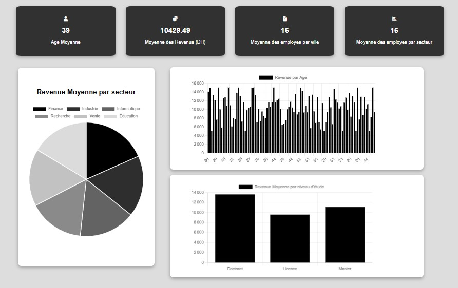

# Prédiction de Salaire

Ce projet est une application web complète permettant **d’analyser, d’afficher et de prédire des données liées aux employés**.  
Elle utilise **FastAPI** comme framework backend et un **modèle d’apprentissage automatique enregistré au format `.pkl`** pour la prédiction de salaires.



L’application permet :
- D’afficher des statistiques interactives sur les employés (âge, revenu, secteur, niveau d’étude, etc.)
- De **prédire le salaire estimé** selon l’âge et l’expérience
- De visualiser les résultats sous forme de graphiques avec **Chart.js**

---

## Prérequis

- Python 3.8 ou plus
- fastapi
- uvicorn
- pandas
- numpy
- joblib
- Chart.js (inclus via CDN dans le HTML)

---
## Lancer le serveur

```bash

uvicorn main:app --reload
Le serveur sera accessible sur http://127.0.0.1:8000

Endpoints API :

/data : données des employés (JSON)

/model : endpoint POST pour la prédiction de salaire

---

## Installation des dépendances

```bash
pip install -r requirements.txt
Lancer le serveur


